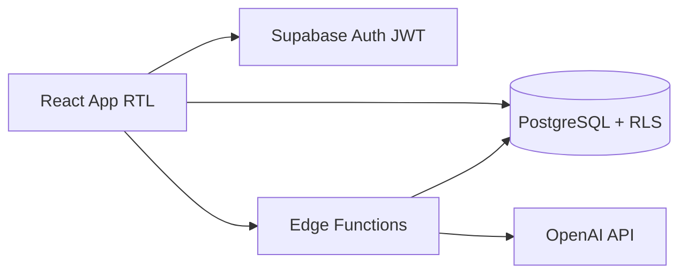
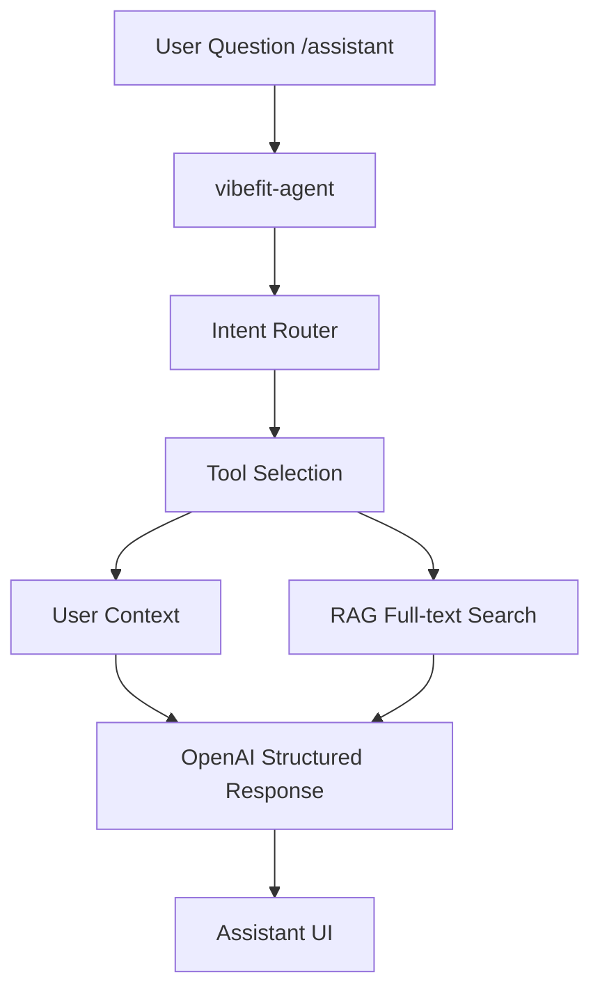
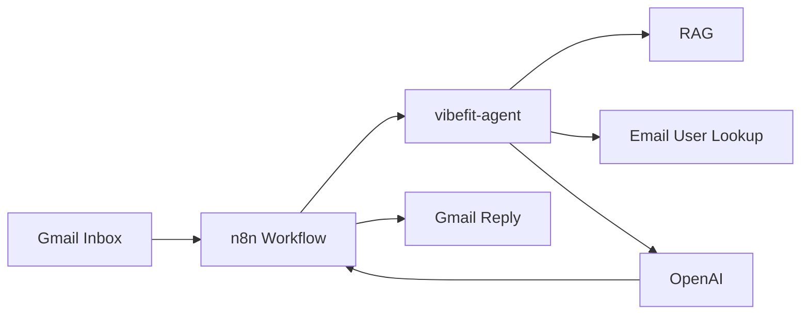
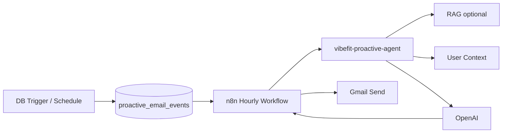
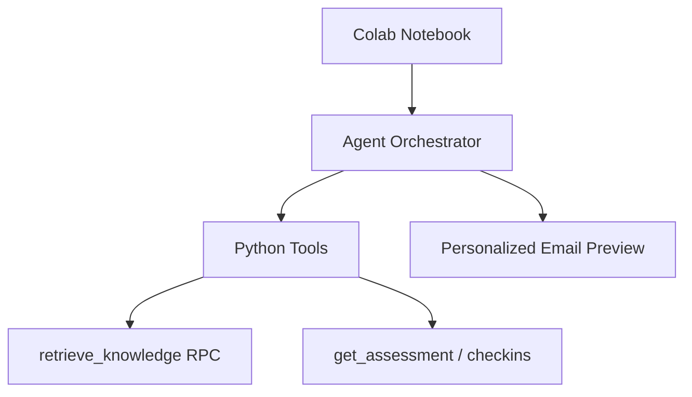

# VibeFit — Architecture

## Platform Stack

**Path:** React App → Supabase Auth → PostgreSQL + RLS → Edge Functions → OpenAI

---

## Assistant (Web Chat)

| Step | Description |
|------|-------------|
| Intent Router | Classifies: open, plan, progress, motivation, safety… |
| Tool Selection | Personal data, analytics, RAG, recommendation context |
| User Context | Profile, assessment, recommendation, last 8 check-ins |
| RAG | `search_knowledge_documents` — **PostgreSQL full-text**, not vector DB |
| Structured Response | JSON: answer, actions, insights, sources |

---

## Incoming Email Agent

**Path:** Gmail → n8n → vibefit-agent → Gmail Reply

- n8n = **Automation** (normalize, dedupe, rate limit, send)
- Agent = **Intelligence** (intent, RAG, personal data, reply)

---

## Proactive Lifecycle Email

**Path:** Database Event / Schedule → n8n → vibefit-proactive-agent → Gmail

Event types: welcome, assessment, recommendation ready, check-in reminder, adherence, energy, inactivity, weekly summary.

---

## Colab Python Demo

**Path:** Python Agent Demo → Tools → RAG → Personalized Email Preview (no Gmail send)

---

## RAG Method (Explicit)

| Aspect | VibeFit Implementation |
|--------|------------------------|
| Storage | `knowledge_documents` table |
| Index | PostgreSQL `tsvector` + GIN |
| Search | `search_knowledge_documents` RPC |
| **Not used** | pgvector, embeddings, vector database |

---

## Edge Functions

| Function | Role |
|----------|------|
| `generate-recommendation` | AI weekly plan from assessment |
| `vibefit-agent` | Web chat + incoming email replies |
| `vibefit-proactive-agent` | Proactive lifecycle emails |

---

## Security Boundaries

| Secret | Location |
|--------|----------|
| `VITE_SUPABASE_URL`, `VITE_SUPABASE_ANON_KEY` | Frontend / HF Variables |
| `OPENAI_API_KEY`, `SUPABASE_SERVICE_ROLE_KEY` | Supabase Edge Secrets only |
| `AGENT_WEBHOOK_SECRET`, `PROACTIVE_AGENT_SECRET` | Supabase + n8n Variables |

---

## Database Tables (Core)

| Table | Purpose |
|-------|---------|
| `profiles`, `assessments`, `recommendations`, `weekly_checkins` | User journey |
| `knowledge_documents` | RAG knowledge base |
| `agent_conversations`, `agent_messages`, `agent_runs` | Chat agent |
| `email_agent_events` | Incoming email idempotency |
| `proactive_email_events`, `email_preferences` | Proactive lifecycle |

---

## Deployment

| Environment | Router | Config |
|-------------|--------|--------|
| Local | BrowserRouter | `.env` |
| Hugging Face | HashRouter (`VITE_ROUTER_MODE=hash`) | Space Variables + `window.huggingface.variables` |

See: [HUGGINGFACE_DEPLOY.md](HUGGINGFACE_DEPLOY.md), [DEMO_GUIDE.md](DEMO_GUIDE.md)
