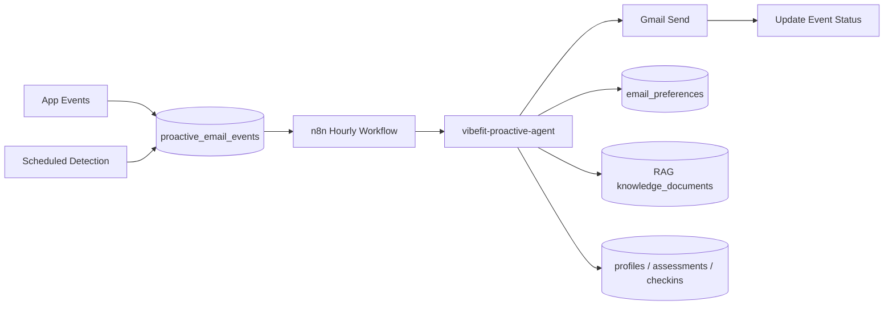

# VibeFit Proactive Lifecycle Email Agent

Event-driven proactive emails for registered users across the fitness journey.

## Architecture



## Message Types

| Event | Trigger | Category |
|-------|---------|----------|
| `user_signed_up` | Profile created + email confirmed | Operational |
| `assessment_completed` | New assessment row | Operational |
| `recommendation_completed` | Recommendation status `completed` | Operational |
| `weekly_checkin_missing` | No check-in in 7 days | Motivational |
| `adherence_dropped` | Low avg adherence / drop ≥15% | Motivational |
| `adherence_improved` | Improvement ≥15% or all sessions done | Motivational |
| `low_energy_detected` | Last 2 check-ins energy ≤2 | Motivational |
| `high_difficulty_detected` | Last 2 difficulty ≥4 | Motivational |
| `inactive_user_detected` | No check-in in 14 days | Motivational |
| `weekly_summary_due` | Active user, once per ISO week | Motivational |

## Agent Decision Flow

1. Verify `PROACTIVE_AGENT_SECRET` (server-to-server only).
2. Load `email_preferences` — block if unsubscribed or category disabled.
3. Apply rate limits: max emails/week, max 1 motivational/day.
4. Gather user context (profile, assessment, recommendation, last 8 check-ins).
5. Optionally retrieve RAG snippets by event type.
6. Generate structured JSON via OpenAI (or safe fallback).
7. Return `should_send: false` with `reason_not_sent` when blocked.

## Anti-Spam Rules

- Unique `deduplication_key` per event window.
- Default max **3 proactive emails/week** per user.
- Max **1 motivational email/day** (operational emails can bypass daily cap).
- Detection skips conflicting motivational events on same day.
- Priority: recommendation_ready → safety → weekly_summary → reminder → motivation.

## Database (Migration 008)

**Tables:** `proactive_email_events`, `email_preferences`

**RPCs:**
- `enqueue_proactive_email_event`
- `fetch_pending_proactive_events`
- `update_proactive_event_status`
- `run_proactive_lifecycle_detection`
- `count_proactive_emails_sent`
- `was_proactive_event_sent_recently`
- `had_motivational_email_today`
- `get_user_email_for_proactive`

## Edge Function

`supabase/functions/vibefit-proactive-agent/index.ts`

**Input:**
```json
{
  "event_type": "adherence_dropped",
  "user_id": "uuid",
  "event_id": "uuid",
  "channel": "email"
}
```

**Header:** `x-vibefit-proactive-secret`

## n8n Workflows

- `n8n/vibefit-proactive-email-agent.workflow.json` — hourly detect + send pipeline
- `n8n/vibefit-weekly-summary.workflow.json` — weekly detection trigger

Regenerate: `npm run sync:n8n-proactive`

## Manual Setup

1. Run `supabase/migrations/008_create_proactive_email_events.sql`
2. Deploy `vibefit-proactive-agent`
3. Set Secrets: `PROACTIVE_AGENT_SECRET`, `OPENAI_API_KEY`, `VIBEFIT_APP_URL`
4. Import n8n workflows + set variables (see `n8n/.env.example`)
5. Connect Gmail OAuth and activate workflows

## Demo Scenario (Doctor)

1. **Colab:** run `notebooks/VibeFit_AI_Agent_RAG_Colab.ipynb` — show tools + RAG + structured email output.
2. **Signup:** create account → welcome event queued → proactive agent generates welcome email.
3. **Weekly motivation:** simulate `adherence_dropped` event → agent uses check-ins + RAG.
4. **n8n:** show hourly workflow fetching pending events and calling proactive agent.

See also: [docs/COLAB_AGENT_DEMO.md](COLAB_AGENT_DEMO.md)
