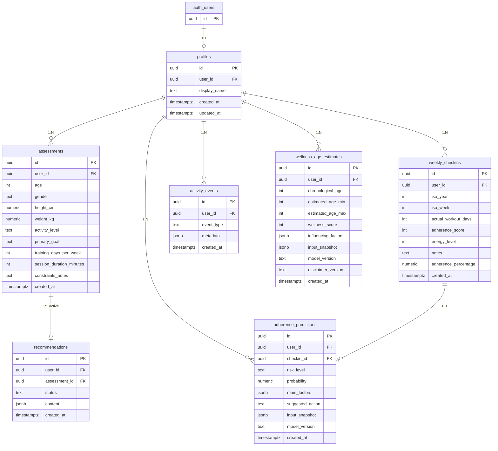

# VibeFit AI Platform — تصور قاعدة البيانات (Database Schema)

> **ملاحظة:** هذا تصور أولي للتخطيط فقط. لا يتضمن SQL أو migrations في هذه المرحلة.

## نظرة عامة على الكيانات



---

## 1. جدول `profiles`

يربط مستخدم المصادقة (`auth.users`) ببيانات التطبيق الأساسية.

| الحقل | النوع | إلزامي | الوصف |
|-------|-------|--------|--------|
| `id` | `uuid` | نعم | PK — يمكن أن يساوي `user_id` |
| `user_id` | `uuid` | نعم | FK → `auth.users.id` — فريد |
| `display_name` | `text` | لا | اسم العرض (اختياري في MVP) |
| `created_at` | `timestamptz` | نعم | وقت الإنشاء |
| `updated_at` | `timestamptz` | نعم | آخر تحديث |

### علاقات

- **واحد لواحد** مع `auth.users`.
- **واحد لكثير** مع `assessments`, `weekly_checkins`, `activity_events`, `wellness_age_estimates`, `adherence_predictions` (الجداول الأخيرة — مرحلة لاحقة).

### قيود مقترحة

- `user_id` UNIQUE.
- إنشاء `profile` تلقائيًا عند التسجيل (trigger أو server logic).

---

## 2. جدول `assessments`

يخزّن نتائج نموذج التقييم الرياضي. كل إرسال = سجل جديد (تاريخ التقييمات).

| الحقل | النوع | إلزامي | الوصف |
|-------|-------|--------|--------|
| `id` | `uuid` | نعم | PK |
| `user_id` | `uuid` | نعم | FK → `profiles.user_id` |
| `age` | `int` | نعم | 16–80 |
| `gender` | `text` | نعم | `male` / `female` / `prefer_not_to_say` |
| `height_cm` | `numeric` | نعم | الطول بالسنتيمتر |
| `weight_kg` | `numeric` | نعم | الوزن بالكيلوغرام |
| `activity_level` | `text` | نعم | `low` / `medium` / `active` |
| `primary_goal` | `text` | نعم | `weight_loss` / `muscle_gain` / `general_fitness` / `endurance` |
| `training_days_per_week` | `int` | نعم | 1–7 |
| `session_duration_minutes` | `int` | نعم | 20 / 30 / 45 / 60 |
| `constraints_notes` | `text` | لا | قيود أو ملاحظات عامة |
| `created_at` | `timestamptz` | نعم | وقت الإرسال |

### علاقات

- **كثير لواحد** مع `profiles` عبر `user_id`.
- **واحد لواحد (نشط)** مع `recommendations` لكل تقييم.

### قيود مقترحة

- فهرس على `(user_id, created_at DESC)` لجلب آخر تقييم بسرعة.

### استعلام شائع

- **آخر تقييم للمستخدم**: `WHERE user_id = ? ORDER BY created_at DESC LIMIT 1`

---

## 3. جدول `recommendations`

يخزّن التوصية الأولية المولّدة من التقييم.

| الحقل | النوع | إلزامي | الوصف |
|-------|-------|--------|--------|
| `id` | `uuid` | نعم | PK |
| `user_id` | `uuid` | نعم | FK → `profiles.user_id` |
| `assessment_id` | `uuid` | نعم | FK → `assessments.id` |
| `status` | `text` | نعم | `active` / `archived` |
| `content` | `jsonb` | نعم | هيكل التوصية المنظمة (انظر أدناه) |
| `created_at` | `timestamptz` | نعم | وقت التوليد |

### هيكل `content` (JSONB)

```json
{
  "summary": "نص ملخص الحالة",
  "suggested_goal": "نص الهدف المقترح",
  "frequency": "نص تواتر التمرين",
  "exercise_types": ["نوع 1", "نوع 2"],
  "safety_notes": "نصائح أمان وإخلاء مسؤولية"
}
```

### علاقات

- **كثير لواحد** مع `profiles`.
- **كثير لواحد** مع `assessments`.

### قيود مقترحة

- فهرس على `(user_id, status)` حيث `status = 'active'` لجلب التوصية الحالية.
- عند تقييم جديد: أرشفة التوصية `active` السابقة لنفس المستخدم (منطق تطبيق).

---

## 4. جدول `weekly_checkins`

سجل المتابعة الأسبوعية.

| الحقل | النوع | إلزامي | الوصف |
|-------|-------|--------|--------|
| `id` | `uuid` | نعم | PK |
| `user_id` | `uuid` | نعم | FK → `profiles.user_id` |
| `iso_year` | `int` | نعم | سنة ISO |
| `iso_week` | `int` | نعم | رقم الأسبوع ISO (1–53) |
| `actual_workout_days` | `int` | نعم | 0–7 |
| `adherence_score` | `int` | نعم | 1–5 (مقياس الالتزام الذاتي) |
| `energy_level` | `int` | نعم | 1–5 |
| `notes` | `text` | لا | ملاحظات حرة |
| `adherence_percentage` | `numeric` | نعم | النسبة المحسوبة 0–100 |
| `created_at` | `timestamptz` | نعم | وقت الإرسال |

### علاقات

- **كثير لواحد** مع `profiles`.

### قيود مقترحة

- **UNIQUE** على `(user_id, iso_year, iso_week)` — متابعة واحدة لكل أسبوع.
- فهرس على `(user_id, created_at DESC)`.

### حساب `adherence_percentage`

يُحسب عند الإدراج من:
- `actual_workout_days` (من هذا السجل)
- `training_days_per_week` (من آخر `assessment` للمستخدم)

---

## 5. جدول `activity_events`

سجل أحداث للتدقيق والتحليل المستقبلي (بدون بيانات حساسة زائدة).

| الحقل | النوع | إلزامي | الوصف |
|-------|-------|--------|--------|
| `id` | `uuid` | نعم | PK |
| `user_id` | `uuid` | نعم | FK → `profiles.user_id` |
| `event_type` | `text` | نعم | نوع الحدث (انظر القائمة) |
| `metadata` | `jsonb` | لا | بيانات إضافية غير حساسة |
| `created_at` | `timestamptz` | نعم | وقت الحدث |

### قيم `event_type` المقترحة (MVP)

| القيمة | متى |
|--------|-----|
| `user_registered` | بعد إنشاء الحساب |
| `assessment_completed` | بعد حفظ تقييم |
| `recommendation_generated` | بعد توليد توصية |
| `checkin_submitted` | بعد إرسال متابعة أسبوعية |
| `login` | (اختياري) تسجيل دخول |

### أمثلة `metadata`

```json
{ "assessment_id": "uuid" }
{ "recommendation_id": "uuid" }
{ "iso_year": 2026, "iso_week": 25, "adherence_percentage": 60 }
```

### علاقات

- **كثير لواحد** مع `profiles`.

### قيم `event_type` المستقبلية (Post-MVP)

| القيمة | متى |
|--------|-----|
| `wellness_age_calculated` | بعد حساب العمر الصحي التقديري |
| `adherence_prediction_generated` | بعد توليد توقع انخفاض الالتزام |

---

## 6. جدول `wellness_age_estimates` (Post-MVP)

يخزّن تقديرات **العمر الصحي التقديري** — مؤشر توعوي غير طبي. **ليس** تشخيصًا ولا قياسًا للشيخوخة الخلوية أو الجينية.

| الحقل | النوع | إلزامي | الوصف |
|-------|-------|--------|--------|
| `id` | `uuid` | نعم | PK |
| `user_id` | `uuid` | نعم | FK → `profiles.user_id` |
| `chronological_age` | `int` | نعم | العمر الزمني وقت الحساب |
| `estimated_age_min` | `int` | نعم | الحد الأدنى للنطاق التقديري |
| `estimated_age_max` | `int` | نعم | الحد الأعلى للنطاق التقديري |
| `wellness_score` | `int` | نعم | 0–100 — درجة توعوية |
| `influencing_factors` | `jsonb` | نعم | عوامل مؤثرة قابلة للتفسير |
| `input_snapshot` | `jsonb` | نعم | لقطة المدخلات المستخدمة (بدون بيانات حساسة زائدة) |
| `model_version` | `text` | نعم | إصدار النموذج/الخوارزمية |
| `disclaimer_version` | `text` | نعم | إصدار نص التنبيه المعروض |
| `created_at` | `timestamptz` | نعم | وقت الحساب (`calculated_at`) |

### هيكل `influencing_factors` (JSONB)

```json
[
  {
    "factor": "weekly_training_frequency",
    "direction": "negative",
    "label_ar": "انخفاض أيام التمرين الأسبوعية",
    "weight": 0.25
  }
]
```

### هيكل `input_snapshot` (JSONB)

```json
{
  "chronological_age": 35,
  "activity_level": "medium",
  "avg_weekly_training_days": 2.5,
  "avg_energy_level": 3.2,
  "adherence_avg": 55
}
```

### علاقات

- **كثير لواحد** مع `profiles` عبر `user_id`.
- سجلات **append-only** — كل حساب جديد = سجل جديد للتاريخ.

### قيود مقترحة

- فهرس على `(user_id, created_at DESC)` لجلب آخر تقدير والتاريخ.
- `estimated_age_min` ≤ `estimated_age_max` دائمًا.

---

## 7. جدول `adherence_predictions` (Post-MVP)

يخزّن توقعات **احتمالية** لانخفاض الالتزام أو التوقف — ليست أحكامًا على المستخدم.

| الحقل | النوع | إلزامي | الوصف |
|-------|-------|--------|--------|
| `id` | `uuid` | نعم | PK |
| `user_id` | `uuid` | نعم | FK → `profiles.user_id` |
| `checkin_id` | `uuid` | نعم | FK → `weekly_checkins.id` — المتابعة المُطلِقة للتوقع |
| `risk_level` | `text` | نعم | `low` / `medium` / `high` |
| `probability` | `numeric` | نعم | احتمال تقريبي (0.0–1.0) |
| `main_factors` | `jsonb` | نعم | أهم العوامل المؤثرة قابلة للتفسير |
| `suggested_action` | `text` | نعم | إجراء مقترح — لا يُنفَّذ تلقائيًا |
| `input_snapshot` | `jsonb` | نعم | لقطة المدخلات (سلوك المنصة فقط) |
| `model_version` | `text` | نعم | إصدار النموذج |
| `created_at` | `timestamptz` | نعم | وقت التوقع (`predicted_at`) |

### هيكل `main_factors` (JSONB)

```json
[
  {
    "factor": "days_since_last_activity",
    "value": 10,
    "label_ar": "مرّ 10 أيام دون نشاط مسجّل"
  },
  {
    "factor": "missed_checkins",
    "value": 2,
    "label_ar": "تخطّيت متابعتين أسبوعيتين"
  }
]
```

### علاقات

- **كثير لواحد** مع `profiles` عبر `user_id`.
- **كثير لواحد** مع `weekly_checkins` عبر `checkin_id` (توقع لكل متابعة عند توفر بيانات كافية).

### قيود مقترحة

- فهرس على `(user_id, created_at DESC)`.
- فهرس على `checkin_id` للربط السريع.

### ملاحظة تنفيذية

- **إنشاء السجلات** يتم من **Backend موثوق** (Edge Function / Server) — ليس INSERT مباشر من العميل.
- المستخدم **يقرأ** تقديراته فقط؛ لا يعدّل ولا يحذف نتائج التحليل.

---

## سياسات الوصول المقترحة (RLS Policies)

> تُطبَّق على مستوى Postgres (مثلاً Supabase RLS). المبدأ: **المستخدم يصل لصفوفه فقط** عبر `auth.uid() = user_id`.

### `profiles`

| العملية | السياسة |
|---------|---------|
| SELECT | المستخدم يقرأ صفه فقط (`user_id = auth.uid()`) |
| INSERT | المستخدم ينشئ صفه فقط (`user_id = auth.uid()`) |
| UPDATE | المستخدم يحدّث صفه فقط |
| DELETE | غير مسموح في MVP (أو soft delete لاحقًا) |

### `assessments`

| العملية | السياسة |
|---------|---------|
| SELECT | `user_id = auth.uid()` |
| INSERT | `user_id = auth.uid()` |
| UPDATE | غير مطلوب في MVP (تقييمات append-only) |
| DELETE | غير مسموح في MVP |

### `recommendations`

| العملية | السياسة |
|---------|---------|
| SELECT | `user_id = auth.uid()` |
| INSERT | `user_id = auth.uid()` (عبر server/function موثوق) |
| UPDATE | `user_id = auth.uid()` (لأرشفة الحالة فقط — يُفضَّل عبر server) |
| DELETE | غير مسموح |

### `weekly_checkins`

| العملية | السياسة |
|---------|---------|
| SELECT | `user_id = auth.uid()` |
| INSERT | `user_id = auth.uid()` |
| UPDATE | غير مسموح في MVP (متابعة واحدة غير قابلة للتعديل) |
| DELETE | غير مسموح |

### `activity_events`

| العملية | السياسة |
|---------|---------|
| SELECT | `user_id = auth.uid()` |
| INSERT | `user_id = auth.uid()` |
| UPDATE / DELETE | غير مسموح (سجل تدقيق append-only) |

### `wellness_age_estimates` (Post-MVP)

| العملية | السياسة |
|---------|---------|
| SELECT | `user_id = auth.uid()` — المستخدم يقرأ تقديراته فقط |
| INSERT | **Backend موثوق فقط** (service role / Edge Function) — العميل لا يُدرج |
| UPDATE | غير مسموح (append-only) |
| DELETE | غير مسموح |

### `adherence_predictions` (Post-MVP)

| العملية | السياسة |
|---------|---------|
| SELECT | `user_id = auth.uid()` — المستخدم يقرأ توقعاته فقط |
| INSERT | **Backend موثوق فقط** — يُستدعى بعد `weekly_checkin` |
| UPDATE | غير مسموح (append-only) |
| DELETE | غير مسموح |

---

## ملاحظات تصميمية

### لماذا `user_id` مكرر في كل جدول؟

- تبسيط سياسات RLS دون joins معقدة.
- استعلامات Dashboard مباشرة per-user.

### لماذا `assessments` append-only؟

- الاحتفاظ بتاريخ التغيّر.
- التوصية مرتبطة بتقييم محدد.

### لماذا `content` كـ JSONB في `recommendations`؟

- مرونة لإضافة أقسام لاحقًا دون تغيير schema.
- عرض مباشر في الواجهة.

### ما الذي يُستبعد من التخزين؟

- كلمات المرور (تبقى في Auth Provider فقط).
- لا جداول دفع، واتساب، CV في MVP.
- لا بيانات جينية أو سريرية أو تشخيصات طبية في `input_snapshot`.
- ملفات نماذج ML تُخزَّن خارج قاعدة بيانات المستخدم (artifact store) — ليس في جداول MVP.

### لماذا `input_snapshot`؟

- إعادة إنتاج النتيجة لاحقًا دون إعادة استعلام كل الجداول.
- تدقيق ومراجعة انحياز النموذج — مع تقليل البيانات للحد الضروري فقط.

---

## فهارس مقترحة (Indexes)

| الجدول | الفهرس | الغرض |
|--------|--------|--------|
| `profiles` | `UNIQUE(user_id)` | ربط سريع |
| `assessments` | `(user_id, created_at DESC)` | آخر تقييم |
| `recommendations` | `(user_id, status)` | التوصية النشطة |
| `weekly_checkins` | `UNIQUE(user_id, iso_year, iso_week)` | منع التكرار |
| `activity_events` | `(user_id, created_at DESC)` | سجل النشاط |
| `wellness_age_estimates` | `(user_id, created_at DESC)` | آخر تقدير + التاريخ (Post-MVP) |
| `adherence_predictions` | `(user_id, created_at DESC)` | آخر توقع (Post-MVP) |
| `adherence_predictions` | `(checkin_id)` | ربط بالمتابعة (Post-MVP) |
