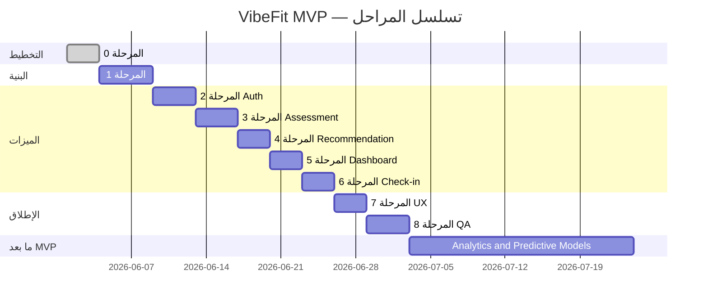

# VibeFit AI Platform — خارطة الطريق (Roadmap)

> تقسيم المشروع إلى مراحل صغيرة قابلة للتنفيذ والمراجعة. كل مهمة مستقلة قدر الإمكان.

---

## المرحلة 0: التخطيط والتوثيق

**الهدف:** تثبيت النطاق والمتطلبات قبل أي كود.

- [x] إنشاء `docs/project-brief.md`
- [x] إنشاء `docs/requirements.md`
- [x] إنشاء `docs/user-flow.md`
- [x] إنشاء `docs/database-schema.md`
- [x] إنشاء `docs/roadmap.md`
- [ ] مراجعة الوثائق والموافقة على نطاق MVP

---

## المرحلة 1: إعداد المشروع والبنية التحتية

**الهدف:** هيكل المشروع، الاتصال بقاعدة البيانات والمصادقة — بدون ميزات مستخدم بعد.

- [ ] تهيئة مشروع Web (Framework + TypeScript)
- [ ] إعداد بيئة التطوير (`.env.example`، متغيرات Supabase أو البديل)
- [ ] إعداد Supabase Project (Auth + Database)
- [ ] إنشاء migrations للجداول: `profiles`, `assessments`, `recommendations`, `weekly_checkins`, `activity_events`
- [ ] تفعيل RLS وسياسات الوصول لكل جدول
- [ ] إعداد trigger/منطق إنشاء `profile` عند التسجيل
- [ ] هيكل مجلدات المشروع (components, lib, types, pages)
- [ ] إعداد RTL والخطوط العربية في الواجهة

---

## المرحلة 2: المصادقة (Authentication)

**الهدف:** تسجيل، دخول، خروج، وحماية المسارات.

- [ ] صفحة `/signup` — نموذج إنشاء حساب + تحقق
- [ ] صفحة `/login` — تسجيل دخول
- [ ] تسجيل الخروج من أي صفحة مصادقة
- [ ] Middleware/Guard لحماية المسارات المصادقة
- [ ] توجيه تلقائي حسب حالة التقييم بعد الدخول
- [ ] تسجيل `activity_event`: `user_registered`
- [ ] معالجة أخطاء المصادقة (بريد مكرر، بيانات خاطئة)

---

## المرحلة 3: التقييم الرياضي (Fitness Assessment)

**الهدف:** نموذج التقييم وحفظه.

- [ ] صفحة `/assessment` — نموذج بجميع الحقول الإلزامية
- [ ] تحقق Client-side للحقول
- [ ] API/Server Action لحفظ التقييم مع تحقق Server-side
- [ ] عرض رسائل خطأ عربية واضحة
- [ ] تسجيل `activity_event`: `assessment_completed`
- [ ] منع الإرسال المزدوج (loading state)

---

## المرحلة 4: توليد التوصية (Recommendation Engine)

**الهدف:** محرك قواعدي (rule-based) يولّد توصية منظمة.

- [ ] تعريف قواعد التوصية حسب `primary_goal` و`activity_level` و`training_days_per_week`
- [ ] دالة توليد `content` JSONB بالأقسام الخمسة
- [ ] حفظ `recommendations` مع `status = active`
- [ ] أرشفة التوصية السابقة عند تقييم جديد
- [ ] تسجيل `activity_event`: `recommendation_generated`
- [ ] معالجة فشل التوليد (إعادة محاولة من Dashboard)

---

## المرحلة 5: لوحة التحكم (Dashboard)

**الهدف:** عرض التوصية وحالة المستخدم.

- [ ] صفحة `/dashboard` — عرض التوصية النشطة
- [ ] حالة "لا يوجد تقييم" مع CTA → `/assessment`
- [ ] عرض ملخص آخر تقييم (اختياري)
- [ ] عرض نسبة الالتزام (أو "—" قبل أول متابعة)
- [ ] روابط للمتابعة الأسبوعية وتحديث التقييم
- [ ] تصميم متجاوب (mobile-first)

---

## المرحلة 6: المتابعة الأسبوعية (Weekly Check-in)

**الهدف:** نموذج المتابعة وحساب الالتزام.

- [ ] صفحة `/checkin` — نموذج المتابعة
- [ ] التحقق من عدم وجود متابعة لنفس `(iso_year, iso_week)`
- [ ] حساب `adherence_percentage` عند الحفظ
- [ ] تسجيل `activity_event`: `checkin_submitted`
- [ ] عرض سجل المتابعات السابقة في Dashboard (Should)
- [ ] رسالة نجاح والعودة لـ Dashboard

---

## المرحلة 7: الصفحة الرئيسية والتجربة الكاملة

**الهدف:** ربط الرحلة من البداية للنهاية.

- [ ] صفحة `/` — ترحيب + شرح القيمة + أزرار CTA
- [ ] توحيد التنقل (Navbar: Dashboard، متابعة، خروج)
- [ ] رسائل تذكير نصية في Dashboard لإكمال المتابعة الأسبوعية
- [ ] مراجعة جميع حالات الخطأ من `requirements.md`
- [ ] مراجعة إمكانية الوصول (labels، تباين، keyboard)

---

## المرحلة 8: الاختبار والإطلاق الأولي

**الهدف:** التحقق من معايير القبول ونشر MVP.

- [ ] اختبار يدوي لرحلة المستخدم الجديد كاملة
- [ ] اختبار المستخدم العائد (مع/بدون تقييم)
- [ ] اختبار RLS (مستخدم A لا يرى بيانات مستخدم B)
- [ ] اختبار المتابعة المكررة لنفس الأسبوع
- [ ] اختبار حساب نسبة الالتزام (حالات 0%، 60%، 100% cap)
- [ ] نشر بيئة Staging
- [ ] نشر بيئة Production
- [ ] مراجعة نهائية لنطاق MVP (لا ميزات خارج النطاق)

---

## Phase — Analytics and Predictive Models (Post-MVP)

**الهدف:** بعد اكتمال MVP وجمع بيانات كافية من التقييمات والمتابعات الأسبوعية — بناء واعتماد نماذج **العمر الصحي التقديري** و**توقع انخفاض الالتزام**، ثم دمجها في Dashboard.

**شرط البدء:** إطلاق MVP ناجح + بيانات حقيقية أو synthetic للتطوير + الحد الأدنى من المتابعات مُحدَّد.

- [ ] تحديد الحد الأدنى من البيانات اللازمة (عدد التقييمات، المتابعات، الأسابيع)
- [ ] إنشاء Synthetic Dataset للتطوير والاختبار
- [ ] بناء baseline model لتوقع الالتزام (Adherence & Drop-off Risk)
- [ ] مقارنة عدة نماذج (baseline vs candidates)
- [ ] تقييم النماذج: Precision و Recall و F1 و ROC-AUC
- [ ] إضافة Explainability للعوامل المؤثرة (`influencing_factors`, `main_factors`)
- [ ] بناء طريقة حساب **العمر الصحي التقديري** (نطاق + Wellness Score)
- [ ] عرض النتيجة كنطاق (`estimated_age_min` – `estimated_age_max`) — ليس رقمًا مؤكدًا
- [ ] إضافة Model Versioning (`model_version`, `disclaimer_version`)
- [ ] اختبار الانحياز (bias) والدقة على شرائح مختلفة
- [ ] إضافة Disclaimer واضح: تقديري، غير طبي، لا يقيس الشيخوخة الخلوية أو الجينية
- [ ] إنشاء migrations لجداول `wellness_age_estimates` و `adherence_predictions`
- [ ] تفعيل RLS: قراءة المستخدم لتقديراته فقط؛ INSERT من Backend موثوق
- [ ] دمج النتائج في Dashboard **بعد اعتمادها** — لا قبل اجتياز التقييم
- [ ] حالة «لا توجد بيانات كافية لإجراء التقدير حاليًا» عند نقص البيانات
- [ ] التأكد: لا تعديل تلقائي للخطة؛ `suggested_action` اقتراح فقط

---

## ما بعد MVP (خارج النسخة الأولى — للمرجع فقط)

> **لا يُنفَّذ في المراحل 0–8.** مذكور للتخطيط المستقبلي.

- [ ] **العمر الصحي التقديري** (Estimated Wellness Age) — انظر Phase: Analytics
- [ ] **توقع انخفاض الالتزام** (Adherence & Drop-off Risk Prediction) — انظر Phase: Analytics
- [ ] باقات مدفوعة ودفع
- [ ] تكامل واتساب
- [ ] Computer Vision
- [ ] تطبيق جوال
- [ ] RAG / AI Agents للتوصيات المتقدمة
- [ ] تشخيص أو محتوى طبي متخصص

---

## تقدير تسلسل التنفيذ

*التقديرات تقريبية وتُحدَّث عند بدء التنفيذ.*

---

## تعريف "تم الإنجاز" (Definition of Done) لكل مرحلة

- الكود يعمل محليًا بدون أخطاء حرجة.
- معايير القبول الخاصة بالمرحلة محققة.
- RLS مفعّل لأي جدول جديد.
- لا ميزات خارج نطاق MVP مضافة.
- واجهة عربية RTL للصفحات المضافة.
