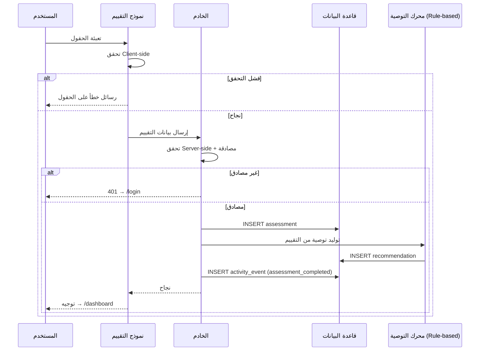
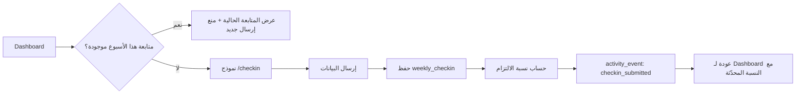
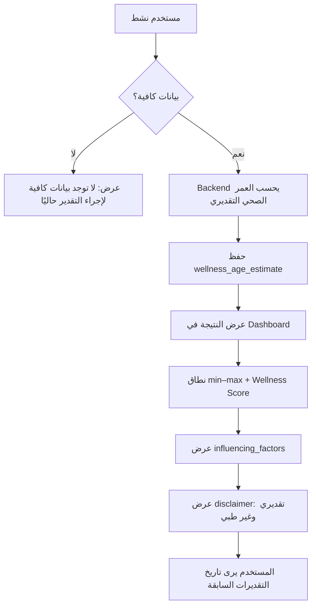
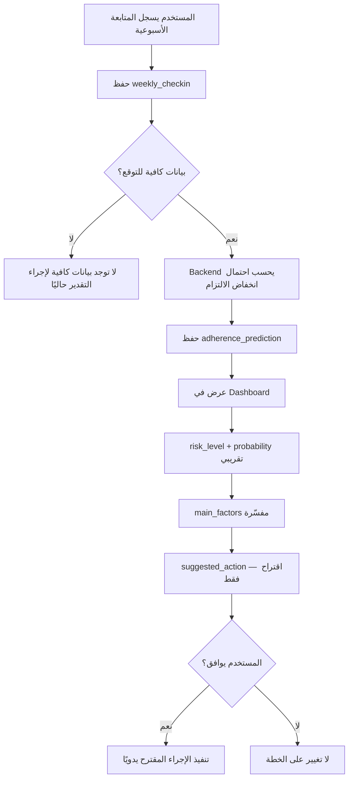
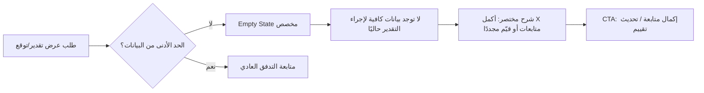

# VibeFit AI Platform — رحلة المستخدم (User Flow)

## نظرة عامة

```mermaid
flowchart TD
    A[زائر جديد] --> B{لديه حساب؟}
    B -->|لا| C[إنشاء حساب /signup]
    B -->|نعم| D[تسجيل الدخول /login]
    C --> E[نموذج التقييم /assessment]
    D --> F{يوجد تقييم محفوظ؟}
    F -->|لا| E
    F -->|نعم| G[لوحة التحكم /dashboard]
    E --> H[حفظ التقييم]
    H --> I[توليد التوصية]
    I --> G
    G --> J{متابعة أسبوعية؟}
    J -->|نعم| K[/checkin]
    K --> L[حساب نسبة الالتزام]
    L --> G
    J -->|لا| G
```

---

## 1. رحلة المستخدم الجديد (New User Journey)

### الخطوات

| # | الخطوة | الصفحة | النتيجة |
|---|--------|--------|---------|
| 1 | يزور الصفحة الرئيسية | `/` | يرى شرحًا مختصرًا + أزرار "ابدأ" / "تسجيل الدخول" |
| 2 | ينقر "ابدأ" أو "إنشاء حساب" | `/signup` | نموذج: بريد + كلمة مرور + تأكيد كلمة المرور |
| 3 | يرسل النموذج بنجاح | — | إنشاء حساب + `profile` + جلسة نشطة |
| 4 | إعادة توجيه تلقائية | `/assessment` | لا يوجد تقييم سابق |
| 5 | يملأ التقييم الرياضي | `/assessment` | تحقق من الحقول |
| 6 | يرسل التقييم | — | حفظ في `assessments` |
| 7 | توليد التوصية | — | إنشاء `recommendations` + `activity_event` |
| 8 | إعادة توجيه | `/dashboard` | عرض التوصية + نسبة التزام أولية (0% أو N/A حتى أول متابعة) |

### نقاط قرار

- **بعد التسجيل**: دائمًا → التقييم (لا تخطّي).
- **بعد التقييم**: دائمًا → لوحة التحكم.

---

## 2. رحلة المستخدم العائد (Returning User Journey)

### 2أ. مستخدم لديه تقييم وتوصية

| # | الخطوة | النتيجة |
|---|--------|---------|
| 1 | `/login` | جلسة نشطة |
| 2 | توجيه تلقائي | `/dashboard` |
| 3 | يرى التوصية + آخر نسبة التزام + سجل المتابعات | — |
| 4 | (اختياري) يفتح `/checkin` | متابعة أسبوعية جديدة إن لم يُرسل لهذا الأسبوع |

### 2ب. مستخدم سجّل دخوله لكن لم يكمل التقييم

| # | الخطوة | النتيجة |
|---|--------|---------|
| 1 | `/login` | — |
| 2 | النظام يكتشف عدم وجود `assessment` | توجيه → `/assessment` |
| 3 | يكمل التقييم | نفس مسار المستخدم الجديد من الخطوة 6 |

### 2ج. مستخدم يريد تحديث التقييم (Should — خارج Must لكن مذكور في القصص)

| # | الخطوة | النتيجة |
|---|--------|---------|
| 1 | من Dashboard → "تحديث التقييم" | `/assessment` (وضع تحديث) |
| 2 | إرسال تقييم جديد | تقييم جديد + توصية جديدة نشطة |
| 3 | العودة | `/dashboard` مع التوصية المحدّثة |

---

## 3. إرسال التقييم (Assessment Submission Flow)



### حالات خاصة

| الحالة | السلوك |
|--------|--------|
| إرسال مزدوج (double submit) | منع بزر loading / idempotency على مستوى الجلسة |
| فشل الحفظ بعد التحقق | إظهار خطأ؛ البيانات تبقى في النموذج |
| نجاح الحفظ وفشل التوصية | التقييم محفوظ؛ Dashboard تعرض زر "إعادة توليد التوصية" |

---

## 4. توليد التوصية (Recommendation Generation Flow)

### المدخلات

- بيانات `assessment` الأخير للمستخدم.

### المنطق (Rule-based — MVP)

```
IF goal = فقدان_وزن → تمارين cardio + قوة خفيفة + عجز caloric عام
IF goal = بناء_عضلات → تمارين مقاومة + بروتين عام
IF activity_level = منخفض → 3 أيام كحد أقصى مقترح
IF available_days < المقترح → تعديل التواتر ليطابق المتاح
```

### المخرجات

كائن `recommendation` بأقسام:

1. `summary` — ملخص الحالة
2. `suggested_goal` — الهدف المقترح
3. `frequency` — تواتر التمرين
4. `exercise_types` — أنواع التمارين
5. `safety_notes` — نصائح أمان + إخلاء مسؤولية

### التدفق

| # | الحدث |
|---|-------|
| 1 | يُستدعى بعد `INSERT assessment` |
| 2 | يُنشئ سجل `recommendation` بحالة `active` |
| 3 | إن وُجدت توصية `active` سابقة لنفس المستخدم من تقييم أقدم → تُعلَّم `archived` (اختياري في MVP: الإبقاء على الأحدث فقط) |
| 4 | `activity_event`: `recommendation_generated` |

---

## 5. المتابعة الأسبوعية (Weekly Check-in Flow)



### حقول النموذج

- أيام التمرين الفعلية (0–7)
- الالتزام بالخطة (1–5)
- مستوى الطاقة (1–5)
- ملاحظات (اختياري)

### حساب الالتزام بعد الإرسال

```
planned_days = من آخر assessment.training_days_per_week
actual_days = من weekly_checkin.actual_workout_days
adherence_pct = min(round((actual_days / planned_days) * 100), 100)
```

### عرض في Dashboard

- **نسبة الالتزام**: من آخر متابعة.
- **الاتجاه** (اختياري Should): مقارنة بالأسبوع السابق إن وُجد.

---

## 6. حالات الفشل (Failure States)

### 6أ. فشل المصادقة

| السيناريو | التدفق |
|-----------|--------|
| جلسة منتهية أثناء ملء نموذج | حفظ محلي اختياري → `/login` → إعادة توجيه للصفحة السابقة |
| كلمة مرور خاطئة | بقاء في `/login` + رسالة عامة |
| حساب غير موجود | نفس الرسالة العامة (أمان) |

### 6ب. فشل الشبكة

| السيناريو | التدفق |
|-----------|--------|
| timeout أثناء الإرسال | رسالة خطأ + إعادة محاولة |
| offline | كشف عدم الاتصال + تعطيل الإرسال مؤقتًا |

### 6ب. فشل التحقق من البيانات

| السيناريو | التدفق |
|-----------|--------|
| حقول ناقصة | تمييز الحقول + scroll للأول |
| قيم غير منطقية | رسالة تحقق محددة بالحقل |

### 6د. فشل منطق الأعمال

| السيناريو | التدفق |
|-----------|--------|
| متابعة مكررة لنفس الأسبوع | رفض + عرض المتابعة الموجودة |
| Dashboard بدون تقييم | CTA واضح → `/assessment` |
| Dashboard بدون توصية رغم وجود تقييم | حالة استثنائية + "إعادة توليد" |

### 6هـ. فشل الصلاحيات

| السيناريو | التدفق |
|-----------|--------|
| مستخدم يحاول فتح `/dashboard` بدون تسجيل | → `/login` |
| محاولة قراءة بيانات مستخدم آخر عبر ID | RLS تمنع → بيانات فارغة أو 403 |

---

## 7. خريطة الحالات (State Map) للمستخدم

| الحالة | الوصف | الصفحة الافتراضية |
|--------|--------|-------------------|
| `anonymous` | غير مسجّل | `/` |
| `authenticated_no_assessment` | مسجّل بدون تقييم | `/assessment` |
| `authenticated_with_recommendation` | مسجّل + تقييم + توصية | `/dashboard` |
| `authenticated_pending_recommendation` | تقييم محفوظ بدون توصية | `/dashboard` (حالة خطأ/انتظار) |

---

## 8. ملخص نقاط الاحتكاك المتوقعة

1. **طول نموذج التقييم** — تقليل الحقول للحد الأدنى في MVP.
2. **عدم وضوح نسبة الالتزام** — شرح مختصر تحت الرقم في Dashboard.
3. **نسيان المتابعة الأسبوعية** — تذكير داخل Dashboard (نصي فقط في MVP، بدون push/email).

---

## 9. رحلات مستقبلية (Post-MVP — خارج النسخة الأولى)

> لا تُنفَّذ هذه التدفقات في MVP. تتطلب جمع بيانات كافية ونماذج تحليلية معتمدة.

### 9.1 العمر الصحي التقديري (Estimated Wellness Age)



#### الخطوات

| # | الخطوة | النتيجة |
|---|--------|---------|
| 1 | المستخدم يكمل عددًا كافيًا من **التقييمات** و**المتابعات الأسبوعية** | استيفاء الحد الأدنى من البيانات (يُحدَّد في مرحلة Analytics) |
| 2 | النظام (Backend موثوق) يحسب **العمر الصحي التقديري** | إنشاء سجل في `wellness_age_estimates` |
| 3 | تظهر النتيجة في Dashboard | **نطاق تقريبي** (مثلاً: 28–32 سنة) + `wellness_score` (0–100) |
| 4 | تفسير العوامل | قائمة `influencing_factors` بلغة واضحة (مثلاً: «انخفاض أيام التمرين») |
| 5 | تنبيه إلزامي | `disclaimer`: مؤشر توعوي — ليس تشخيصًا ولا يقيس الشيخوخة الخلوية أو الجينية |
| 6 | (اختياري) المستخدم يفتح سجل التاريخ | قائمة تقديرات سابقة مع `calculated_at` و`model_version` |

#### قيود العرض

- **لا** يُعرض رقم عمر واحد كحقيقة مؤكدة.
- **لا** يُستخدم مصطلح «العمر البيولوجي الحقيقي».
- **لا** توصيات علاجية أو تشخيص.

---

### 9.2 توقع انخفاض الالتزام (Adherence & Drop-off Risk Prediction)



#### الخطوات

| # | الخطوة | النتيجة |
|---|--------|---------|
| 1 | المستخدم يرسل **متابعة أسبوعية** | حفظ `weekly_checkin` |
| 2 | Backend يحسب **احتمال انخفاض الالتزام** | `adherence_prediction` مرتبط بـ `checkin_id` |
| 3 | تظهر النتيجة في **Dashboard** | `risk_level` (low/medium/high) + `probability` مع تسمية «احتمال تقريبي» |
| 4 | عرض العوامل | `main_factors` بلغة محايدة (مثلاً: «مرّ 10 أيام دون نشاط») |
| 5 | اقتراح إجراء | `suggested_action` (تذكير، تقليل أيام التمرين المقترحة، إعادة تقييم) |
| 6 | **لا تعديل تلقائي** | الخطة والتوصية تبقى كما هي حتى يختار المستخدم |

#### قيود العرض

- لغة **داعمة** — لا وصف بأن المستخدم «فاشل» أو «غير ملتزم».
- التوقع **احتمالي** — ليس قرارًا مؤكدًا.
- تغيير الخطة يتطلب **موافقة صريحة** من المستخدم.

---

### 9.3 حالة عدم توفر بيانات كافية (Insufficient Data)

تنطبق على **كلا الميزتين** المستقبليتين.



| العنصر | الوصف |
|--------|--------|
| **الرسالة** | «لا توجد بيانات كافية لإجراء التقدير حاليًا» |
| **السبب** | لا يُكشف تفصيل تقني؛ شرح بسيط للمستخدم |
| **الإجراء** | زر للمتابعة الأسبوعية أو التقييم حسب السياق |
| **ممنوع** | عرض أرقام افتراضية أو تقديرات منخفضة الثقة |

---

### 9.4 تحديث خريطة الحالات (مستقبلي)

| الحالة | الوصف |
|--------|--------|
| `insufficient_analytics_data` | بيانات غير كافية لعرض العمر الصحي التقديري أو توقع الالتزام |
| `wellness_age_available` | تقدير عمر صحي متاح للعرض |
| `adherence_prediction_available` | توقع التزام متاح من آخر متابعة |
